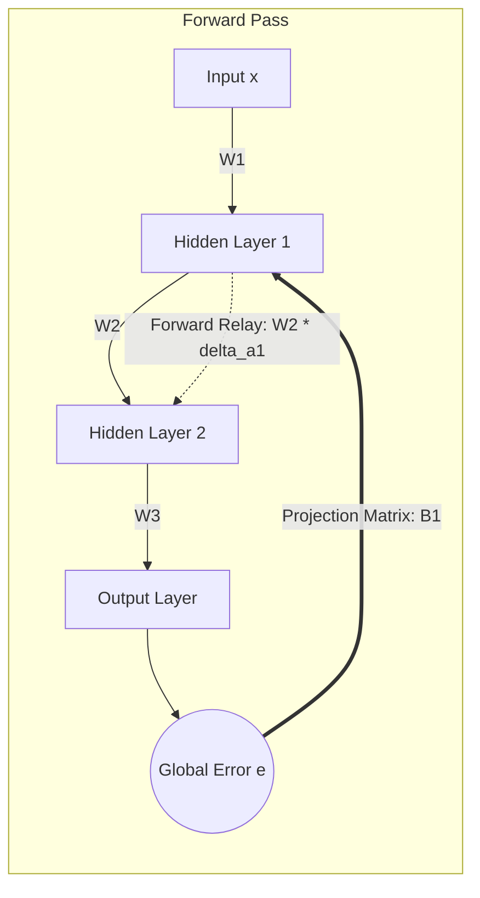

# Indirect Feedback Alignment (IFA)

This repository explores **Indirect Feedback Alignment (IFA)** as a bio-plausible alternative to traditional Backpropagation (BP) for training neural networks

**_*Repository is Under Construction_**
---

## Context

Standard deep learning relies on **Backpropagation (BP)** to compute weight updates. While effective, BP suffers from the **weight transport problem**: it requires backward error propagation to use the exact transpose of forward weight matrices ($W^T$). In biological neural networks, exact symmetric backward transmission is considered implausible, driving interest in feedback-aligned algorithms.

---

## What is IFA?

**Indirect Feedback Alignment (IFA)** is a feedback alignment variant proposed by Arild Nøkland (2016).

Unlike Backpropagation (which propagates error backward layer-by-layer) or Direct Feedback Alignment (which projects output error directly to every hidden layer), **IFA projects the global output error directly to the first hidden layer only** via a random projection matrix. The update signal then propagates forward through subsequent hidden layers using the forward weights.

---

## Why IFA?

* **Eliminates Weight Transport:** Operates without requiring symmetric forward and backward weight matrices ($W^T$).
* **Alternative Error Pathways:** Demonstrates that deep networks can learn even when error signals bypass upper hidden layers during the initial feedback projection.
* **Biologically Motivated:** Shows that error signals do not need to traverse every forward layer in reverse sequence to drive learning.

---

## How It Works

1. **Forward Pass:** Input $x$ propagates through hidden layers to compute prediction $\hat{y}$ and global error $e$.
2. **First Hidden Layer Projection:** Global error $e$ is projected directly to the first hidden layer via matrix $B_1$:
   $$\delta a_1 = (B_1 e) \odot f'(a_1)$$
3. **Indirect Forward Relay:** Subsequent hidden layers derive their error update signals by propagating the first layer's update signal forward through weight matrices $W$:
   $$\delta a_k = (W_k \delta a_{k-1}) \odot f'(a_k)$$
4. **Weight Updates:** Layer weights update using local activations and their corresponding layer update signals.

---

## Architecture Flow Diagram

---

### _*Still Under Construction..._
